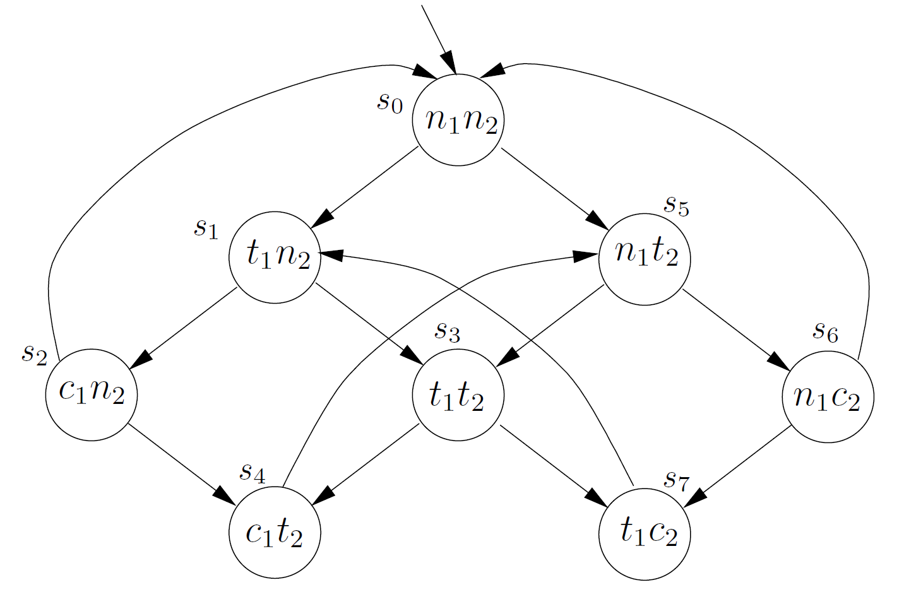
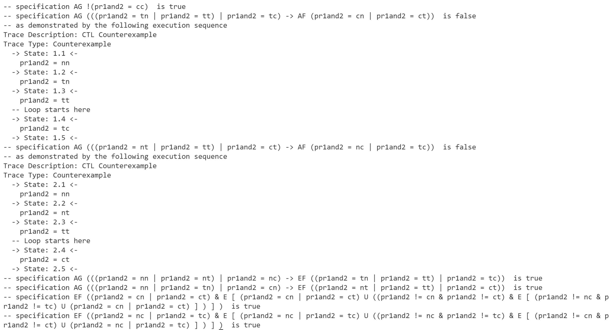
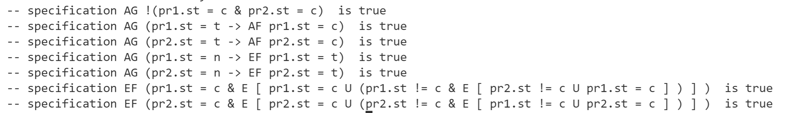
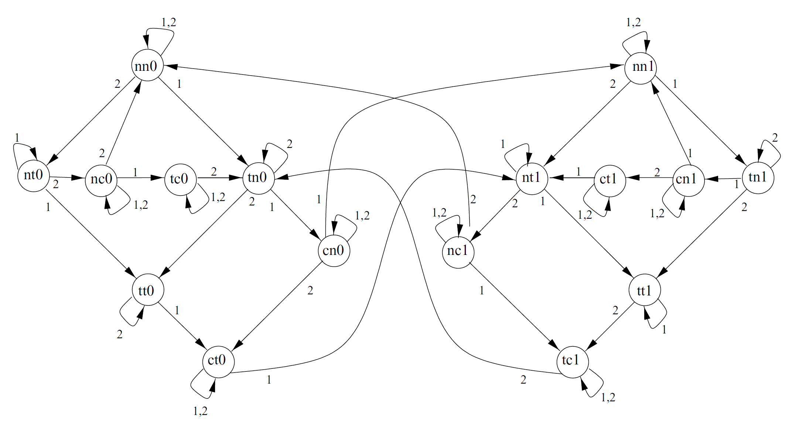

# Lab 2: NuSMV

**郑龙韬 PB18061352**

## Computation Tree Logic (CTL) Design



- processes: 1, 2
- states
  - n: in its non-critical state
  - t: trying to enter its critical state
  - c: in its critical state
- state transitions: $n_i \rightarrow t_i \rightarrow c_i \rightarrow n_i \dots$


### 1. Safety

Only one process is in its critical section at any time.

CTL: $AG\ \neg(c_1\wedge c_2)$

NuSMV code (for [model2](model.smv)):

```
SPEC AG!((pr1.st = c) & (pr2.st = c))
```

### 2. Liveness

Whenever any process requests to enter its critical section, it will eventually be permitted to do so.

CTL: 

$AG\ (t_1\rightarrow AF\ c_1)$

$AG\ (t_2\rightarrow AF\ c_2)$

NuSMV code:

```
SPEC AG((pr1.st = t) -> AF (pr1.st = c))
SPEC AG((pr2.st = t) -> AF (pr2.st = c))
```

### 3. Non-blocking

A process can always request to enter its critical section. In other words, for every state satisfying $n_1$, there is a successor satisfying $t_1$.

CTL: 

$AG\ (n_1 \rightarrow EF\ t_1)$

$AG\ (n_2 \rightarrow EF\ t_2)$

NuSMV code:

```
SPEC AG((pr1.st = n) -> EF (pr1.st = t))
SPEC AG((pr2.st = n) -> EF (pr2.st = t))
```

### 4. No strict sequencing

Processes should not enter their critical section in a strict sequence, i.e., there should be at least one path with two distinct states satisfying $c_1$ such that no state in between them has that property. 

CTL: 

$EF\ (c_1 \wedge E[c_1\ U\ (\neg c_1 \wedge E [\neg c_2\ U\ c_1])])$

$EF\ (c_2 \wedge E[c_2\ U\ (\neg c_2 \wedge E [\neg c_1\ U\ c_2])])$

NuSMV code:

```
SPEC EF(pr1.st = c & E[pr1.st = c U (pr1.st != c & E[pr2.st != c U pr1.st = c])])
SPEC EF(pr2.st = c & E[pr2.st = c U (pr2.st != c & E[pr1.st != c U pr2.st = c])])
```

## Validation of 4 properties

NuSMV code for the 1st attempt model in the slides here: [model1.smv](model1.smv)

```
MODULE main
    VAR
        pr1and2 : {nn, tn, nt, cn, tt, nc, ct, tc, cc};
    ASSIGN
        init(pr1and2) := nn;
        next(pr1and2) := 
            case
                (pr1and2 = nn) : {nn, tn, nt};
                (pr1and2 = tn) : {cn, tt};
                (pr1and2 = nt) : {tt, nc};
                (pr1and2 = cn) : {nn, ct};
                (pr1and2 = tt) : {ct, tc};
                (pr1and2 = nc) : {nn, tc};
                TRUE : pr1and2;
            esac;

    -- safety
    SPEC AG!(pr1and2 = cc)

    -- liveness
    SPEC AG((pr1and2 = tn | pr1and2 = tt | pr1and2 = tc) -> AF (pr1and2 = cn | pr1and2 = ct))
    SPEC AG((pr1and2 = nt | pr1and2 = tt | pr1and2 = ct) -> AF (pr1and2 = nc | pr1and2 = tc))

    -- non-blocking
    SPEC AG((pr1and2 = nn | pr1and2 = nt | pr1and2 = nc) -> EF (pr1and2 = tn | pr1and2 = tt | pr1and2 = tc))
    SPEC AG((pr1and2 = nn | pr1and2 = tn | pr1and2 = cn) -> EF (pr1and2 = nt | pr1and2 = tt | pr1and2 = ct))
    
    -- no strict sequencing
    SPEC EF((pr1and2 = cn | pr1and2 = ct) & E[(pr1and2 = cn | pr1and2 = ct) U ((pr1and2 != cn & pr1and2 != ct) & E[(pr1and2 != nc & pr1and2 != tc) U (pr1and2 = cn | pr1and2 = ct)])])
    SPEC EF((pr1and2 = nc | pr1and2 = tc) & E[(pr1and2 = nc | pr1and2 = tc) U ((pr1and2 != nc & pr1and2 != tc) & E[(pr1and2 != cn & pr1and2 != ct) U (pr1and2 = nc | pr1and2 = tc)])])
```

(The specifications here are modified a bit from the ones from [model2](model.smv) for given state representations)

Run in Terminal:
```
NuSMV model1.smv
```

Result:



Therefore,

- Safety is satisfied
- Liveness is **not** satisfied
- Non-blocking is satisfied
- No strict sequencing is satisfied

---

Model2 improvements here: [model2.smv](model2.smv)

```
MODULE main
    VAR
        pr1 : process proc(pr2.st, turn, FALSE);
        pr2 : process proc(pr1.st, turn, TRUE);
        turn : boolean;
    ASSIGN
        init(turn) := FALSE;

    -- safety
    SPEC AG!((pr1.st = c) & (pr2.st = c))
    -- liveness
    SPEC AG((pr1.st = t) -> AF (pr1.st = c))
    SPEC AG((pr2.st = t) -> AF (pr2.st = c))
    -- non-blocking
    SPEC AG((pr1.st = n) -> EF (pr1.st = t))
    SPEC AG((pr2.st = n) -> EF (pr2.st = t))
    -- no strict sequencing
    SPEC EF(pr1.st = c & E[pr1.st = c U (pr1.st != c & E[pr2.st != c U pr1.st = c])])
    SPEC EF(pr2.st = c & E[pr2.st = c U (pr2.st != c & E[pr1.st != c U pr2.st = c])])

MODULE proc(other-st, turn, myturn)
    VAR
        st : {n, t, c};
    ASSIGN
        init(st) := n;
        next(st) := 
            case
                (st = n) : {t, n};
                (st = t) & (other-st = n) : c;
                (st = t) & (other-st = t) & (turn = myturn) : c;
                (st = c) : {c, n};
                TRUE : st;
            esac;
        next(turn) := 
            case
                turn = myturn & st = c : !turn;
                TRUE : turn;
            esac;
    FAIRNESS running
    FAIRNESS !(st = c)
```

Run in Terminal:
```
NuSMV model2.smv
```

Result:



According to the result, the 4 properties are all satisfied given the improved model. The model is illustrated below.

