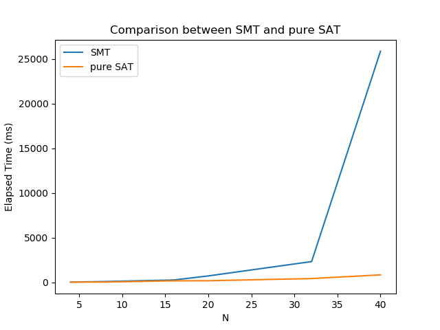

# Lab 1: SAT Solver

**郑龙韬 PB18061352**

## Task 1: N-Queens

代码实现在[n_queens.py](./n_queens.py)，包含SMT的实现与pure SAT的实现。SMT使用slides上的代码，SAT实现的约束为行约束、列约束、对角线约束。

### 实验结果

以下表格和图对比了N取值不同时，两者的效率，观察可以得出，pure SAT的效率要比SMT高，因为实际上SMT需要转化为SAT再进行求解。

|N|Elapsed time of SMT (ms)|Elapsed time of pure SAT (ms)|
|:--:|:--:|:--:|
|4|45.1522|37.2417|
|8|105.8621|51.8267|
|16|279.2518|188.3368|
|20|732.4312|195.6971|
|32|2338.5613|439.6229|
|40|25855.8326|849.2498|



## Task 2: Arithmetic in pure SAT

二进制减法问题描述为$d=a-b$，分别记$a_i$，$b_i$，$c_i$，$d_i$为$a$，$b$，借位，与结果$d$的第$i$位。

### 编码思路

二进制减法运算法则如下：

```
0 – 0 = 0
1 – 0 = 1
1 – 1 = 0
0 – 1 = 1 (Borrow 1 from next high order digit)
```

由此得出在$a_i$，$b_i$，$c_i$三者取值不同时，结果第$i$位$d_i$与借位第$i+1$位$c_{i+1}$的真值表：

|$a_i$|$b_i$|$c_i$|$d_i$|$c_{i+1}$|
|:--:|:--:|:--:|:--:|:--:|
|1|1|1|1|1|
|1|1|0|0|0|
|1|0|1|0|0|
|1|0|0|1|0|
|0|1|1|0|1|
|0|1|0|1|1|
|0|0|1|1|1|
|0|0|0|0|0|

- 观察真值表得$d_i$为$1$当且仅当$\{a_i, b_i, c_i\}$中有1或3个值为$1$，所以有$d_i\leftrightarrow(a_i\leftrightarrow(b_i\leftrightarrow c_i))$。

- 由真值表可得，$c_{i+1}\leftrightarrow ((b_i\wedge c_i) \vee (\neg a_i\wedge b_i\wedge \neg c_i) \vee (\neg a_i\wedge \neg b_i\wedge c_i))$。

- 此外，还有两个初始条件$\neg c_0$与$\neg c_n$。

将上述三个约束记为$\phi$，输入给SAT Solver的条件为$\phi\wedge a \wedge b$，其中$a$，$b$分别为两个操作数的二进制布尔表示（如$a=5$的二进制$101$转化为$a_2 \wedge \neg a_1 \wedge a_0$）。

在实际实现中（代码[subtraction.py](./subtraction.py)），需要首先对位数较少的数进行在高位补零操作，方便运算。约束条件即为上面一行提到的输入给SAT Solver的条件。

### 代码使用文档

修改`__main__`中的变量a、b的赋值语句（十进制），运行`python subtraction.py`即可得到输出结果，包含从SAT Solver输出提取出的对$d_i$的赋值、以及二进制表示的计算结果。

### 实验结果

以下展示了`a = 10`，`b = 5`的输出结果，可以观察到代码自动将位数不足的5填0进行对齐，结果符合二进制减法法则。

```
a: 1010
b: 0101
[(d3, False), (d2, True), (d1, False), (d0, True)]
a - b: 0101
```

以下展示了`a = 5`，`b = 10`的输出结果，结果符合二进制减法法则。

```
a: 0101
b: 1010
[(d3, True), (d2, False), (d1, True), (d0, True)]
a - b: 1011
```

以下展示了`a = 1000`，`b = 100`的输出结果，结果符合二进制减法法则。

```
a: 1111101000
b: 0001100100
[(d9, True), (d8, True), (d7, True), (d6, False), (d5, False), (d4, False), (d3, False), (d2, True), (d1, False), (d0, False)]
a - b: 1110000100
```